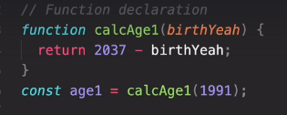
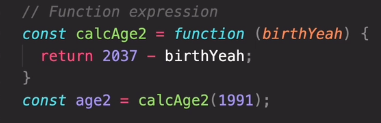
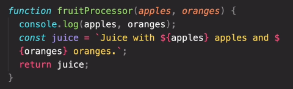
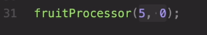

# JS key concepts and documentation

* HTML -> Nouns
* CSS  -> Adjectives
* JS   -> Verbs

---
Javascript is **dynamic typing**: we don't have to manually define the data type of the value stored in a variable.

## Type conversion and coercion

**Type conversion** is when we manually convert form one type to another.

Example:

```js
let age = '1984'; //string
age = Number(age); //explicit conversion to number
```

**Type coercion** is when JS automatically converts behind the scenes for us.

Examples:

```js
'23' - '10' -3 => 10 //number
'23' / '2' => 11.5 //number
2 + 4 + 3 + '5' => '95' //string
```

**Important**: the **+** simbol always convert which is next to it to string.

## Truthy and falsy values

In JS a **truthy**/**falsy** values is a value that is considered **true**/**false** when encountered in a boolean context.

**Falsy** examples:

* false
* 0
* -0
* " "
* null
* undefined
* NaN

**All other values are considered truthy!**

More info: [js-truthy-falsy-expressions](https://frontend.turing.edu/lessons/module-1/js-truthy-falsy-expressions.html)

## Statements and expressions

An **expression** is a piece of code that produce a value.

For example:

```js
1 //produces --> 1
"hello" //produces --> "hello"
5*10 //produces --> 50
num > 10 //produces --> bool (either true or false)
```

A **statement** is an instruction for the computes to do something.

For example:

```js
let hi = 5;
if (hi > 10 ){
    //more statements here
}
```

A tip about this: statements are the rigid structure that holds our program together, while expressions fill in the details.

Statements often have "slots" for expressions. We can put any expression we like into those slots.

For example, declaring a variable has an expression slot:

```js
let hi = // some expression ;
```

More info: [statements-vs-expressions](https://www.joshwcomeau.com/javascript/statements-vs-expressions/)

## The conditional (ternary) operator

A ternary operator evaluates a condition and executes a block of code based on the condition.

It's syntax is:

`condition ? expression1 : expression2`

```js
let bill = 275;
let tip = bill >= 50 && bill <= 300 ? bill * 0.15 : bill * 0.20;

console.log(`The bill was ${bill}, the tip was ${tip}, and the total value ${bill+tip}`);
```

More info: [js-ternary-operator](https://www.programiz.com/javascript/ternary-operator)

## Function declaration vs function expression

Function **declaration**:



Function **expression**:



The main differences between each other are the hoisting. The function declaration allows hoisting while function expression not.

More info: [when-to-use-function-expressions-vs-declaration-fcc](https://www.freecodecamp.org/news/when-to-use-a-function-declarations-vs-a-function-expression-70f15152a0a0/)

More info: [when-to-use-function-expressions-vs-declaration-sidepoint](https://www.sitepoint.com/when-to-use-a-function-expression-vs-function-declaration/)

## Parameters and arguments

The **parameters** are the placeholder declared in the () of the function.

In the next image (apples and oranges in orange ) are the parameters:



The **argument** is the actual value that we use to fill in the placeholder.

In the image below, 5 and 0 are the arguments:



## Arrow functions

An arrow function is simply a special form of function expression that is shorter and therefore faster to write.

Arrow functions do not get a so-called **this** keyword.

More info: [js-arrow-function-gentle](https://www.javascripttutorial.net/es6/javascript-arrow-function/)

More info: [js-arrow-function-doc](https://javascript.info/arrow-functions-basics)

## Arrays

We can declare arrays in two ways:

The most popular:

```js
let friends = ["jose", "adri", "nova"];
```

The second one:

```js
let years = new Array(1984, 1999, 1996);
```

Some array methods are:

```js
friends.push("juan"); // add a element at the end of the array
friends.unshift("pedro"); // add a element at the begining of the array
friends.pop(); // removes the last element
friends.shift(); //removes the first element

friends.indexOf("nova"); //return the index of the element in the array
friends.includes("jose") // return true or false if it finds it or not
```

## Objects

Objects are a unordered collection of **key:value** pairs. Each key-value pair is called a **property**.

```js
let person = {
    firstName : "Antonio",
    lastName : "Soto",
    job : "web developer"
};
```

More info: [js-objects](https://www.javascripttutorial.net/javascript-objects/)

## Dot vs Bracket notation

We can access to the propertys of the object with the dot and bracket notation:

```js
console.log(person.firstName); //prints the name Antonio
console.log(person['firstName']); //prints the same
```

We can use the bracket notation to access or compute some value to access:

```js
let keyName = "name";
console.log(person['first'] + keyName); 
console.log(person['last'] + keyName);
```

## Objects methods

We can create functions in the object, but this is known as **methods**.

```js
let person = {
  firstName: "Antonio",
  lastName: "Soto",
  birthYear: 1997,
  hasDriverLicence: true,
  //   calcAge: function () {
  //     return 2022 - this.birthYear;
  //   },

  //this is also valid
  //   calcAge: function () {
  //     let age = 2022 - this.birthYear;
  //     return age;
  //   },

  //Dry principle with this.age
  calcAge: function () {
    this.age = 2022 - this.birthYear; // here we are creating the property age with this.age
    return this.age;
  },

  getSummary: function () {
    return console.log(
      `This person named ${this.firstName} ${
        this.lastName
      } is ${this.calcAge()} years old and ${
        this.hasDriverLicence ? "has driver licence" : "has not driver licence"
      }`
    );
  },
};

console.log(person.calcAge()); //we call the method first in order to create the this.age property
console.log(person.age);
person.getSummary(); //this print : This person named Antonio Soto is 25 years old and has driver licence
```

## Execution context

This topic could be hard for beginners, maybe you could read later if you are a newbie with JS.

More very detailed info: [js-execution-context](https://www.freecodecamp.org/news/execution-context-how-javascript-works-behind-the-scenes/)

## Scope

Scope concepts:

* **Scoping**: How our program's variables are **organized** and **accessed**. *"Where do variables live?"* or *"Where can we access a certain variable, and where not?"*
* **Lexical scoping**: Scoping is controlled by **placement** of functions and blocks in the code.
* **Scope**: Space or environment in which a certain variable is **declared** (*variable environment in case of functions*). There is the **global** scope, **function** scope, and **block** scope.
* **Scope of a variable**: Region of our code where a certain variable can be **accessed**.

The 3 types of scope:
**Global** scope:

```js
const me = "Antonio";
const job = "web developer";
const year = "1997";
```

* Outside of **any** function or block
* Variables declared in global scope are accessible **everywhere**

**Function** scope:

```js
function calcAge(birthYear){
  const now = 2037;
  const age = now - birthyear;
  return age;
}

console.log(now) // ReferenceError
```

* Variables are accessible only **inside function, NOT** outside
* Also called local scope

**Block Scope (ES6)** scope:

```js
if (year >= 1981 && year <= 1996){
  const millenial = true;
  const food = 'Avocado toast';
}//Example: if block, for loop block, etc.

console.log(millenial) //ReferenceError
```

* Variables are accesible only **inside block** (block scoped). However, this only applies to **let** and **const** variables!
* Functions are **also block scoped** (only in strict mode)

## Destructuring Arrays

When we pass those to a function, it may need not be an object/array as a whole. It may need individual pieces.

*Destructuring assignment* is a special syntax that allows us to “unpack” arrays or objects into a bunch of variables, as sometimes that’s more convenient.

```js
const arr = [1,2,3];
const a = arr[0];
const b = arr[1];
const c = arr[2];
// VS Desctructuring
const [x, y, z] = arr;
console.log(x, y, z);
```

We can use destructuring for receive two values from a function:

```js
const restaurant = {
  starterMenu: ["Garlic bread", "sauce", "cheese"],
  mainMenu: ["pizza", "pasta", "risotto"],
  order: function (starterIndex, mainIndex) {
    return [this.starterMenu[starterIndex], this.mainMenu[mainIndex]];
  },
};

const [starter, main] = restaurant.order(2, 0);
console.log(starter, main); // prints cheese pizza
```

More info: [js-destructuring-fcc](https://www.freecodecamp.org/news/array-and-object-destructuring-in-javascript/)

More info: [js-destructuring-info](https://javascript.info/destructuring-assignment)
