# JS key concepts and documentation

* HTML -> Nouns
* CSS  -> Adjectives
* JS   -> Verbs

---

### Table of contents

[Type conversion and coercion](#type-conversion-and-coercion)\
[Truthy and falsy values](#truthy-and-falsy-values)\
[Statements and expressions](#statements-and-expressions)\
[The conditional (ternary) operator](#the-conditional-(ternary)-operator)\
[Function declaration vs function expression](#function-declaration-vs-function-expression)\
[Parameters and arguments](#parameters-and-arguments)\
[Arrow functions](#arrow-functions)\
[Arrays](#arrays)\
[Objects](#objects)\
[Dot vs Bracket notation](#dot-vs-bracket-notation)\
[Objects methods](#objects-methods)\
[Execution context](#execution-context)\
[Scope](#scope)\
[Destructuring Arrays](#destructuring-arrays)\
[Destructuring Objects](#destructuring-objects)\
[Spread operator](#spread-operator)\
[Rest Pattern](#rest-pattern)\
[Rest parameter](#rest-parameter)\
[Short circuiting (|| and &&)](#short-circuiting-(||-and-&&))\
[Nullish operator](#nullish-operator)\
[Logical Assigment Operators](#logical-assigment-operators)\
[The for-of loop](#the-for-of-loop)\
[Enhanced-object-literals](#enhanced-object-literals)\
[Optional chaining](#optional-chaining)\
[Looping objects: object keys values and entries](#looping-objects:-object-keys-values-and-entries)\
[Sets](#sets)\
[Maps](#maps)\
[Maps Iteration](#maps-iteration)\
[Strings](#strings)\
[Default parameters](#default-parameters)\
[How passing arguments works](#how-passing-arguments-works)\
[First class and higher order functions](#first-class-and-higher-order-functions)\
[Functions acepting callback functions](#functions-acepting-callback-functions)\
[Functions returning functions](#functions-returning-functions)\
[The call and apply method](#the-call-and-apply-method)\
[The bind method](#the-bind-method)\
[Inmediatelly invoked function expressions](#inmediatelly-invoked-function-expressions)\
[Closures](#closures)\
[Array methods](#array-methods)\
[The Foor each loop](#the-foor-each-loop)\
[Dom manipulation](#dom-manipulation)\
[Data transformations: map, filter and reduce](#data-transformations:-map-filter-and-reduce)\
[Filter](#filter)\
[Reduce method](#reduce-method)\
[Chaining-methods](#chaining-methods)\
[Find and findIndex method](#find-and-findIndex-method)\
[Some and every method](#some-and-every-method)\
[Flat and flatmap methods](#flat-and-flatmap-methods)\

---
Javascript is **dynamic typing**: we don't have to manually define the data type of the value stored in a variable.

## Type conversion and coercion

**Type conversion** is when we manually convert form one type to another.

Example:

```js
let age = '1984'; //string
age = Number(age); //explicit conversion to number
```

**Type coercion** is when JS automatically converts behind the scenes for us.

Examples:

```js
'23' - '10' -3 => 10 //number
'23' / '2' => 11.5 //number
2 + 4 + 3 + '5' => '95' //string
```

**Important**: the **+** simbol always convert which is next to it to string.

## Truthy and falsy values

In JS a **truthy**/**falsy** values is a value that is considered **true**/**false** when encountered in a boolean context.

**Falsy** examples:

* false
* 0
* -0
* " "
* null
* undefined
* NaN

**All other values are considered truthy!**

More info: [js-truthy-falsy-expressions](https://frontend.turing.edu/lessons/module-1/js-truthy-falsy-expressions.html)

## Statements and expressions

An **expression** is a piece of code that produce a value.

For example:

```js
1 //produces --> 1
"hello" //produces --> "hello"
5*10 //produces --> 50
num > 10 //produces --> bool (either true or false)
```

A **statement** is an instruction for the computes to do something.

For example:

```js
let hi = 5;
if (hi > 10 ){
    //more statements here
}
```

A tip about this: statements are the rigid structure that holds our program together, while expressions fill in the details.

Statements often have "slots" for expressions. We can put any expression we like into those slots.

For example, declaring a variable has an expression slot:

```js
let hi = // some expression ;
```

More info: [statements-vs-expressions](https://www.joshwcomeau.com/javascript/statements-vs-expressions/)

## The conditional (ternary) operator

A ternary operator evaluates a condition and executes a block of code based on the condition.

It's syntax is:

`condition ? expression1 : expression2`

```js
let bill = 275;
let tip = bill >= 50 && bill <= 300 ? bill * 0.15 : bill * 0.20;

console.log(`The bill was ${bill}, the tip was ${tip}, and the total value ${bill+tip}`);
```

More info: [js-ternary-operator](https://www.programiz.com/javascript/ternary-operator)

## Function declaration vs function expression

Function **declaration**:


Function **expression**:


The main differences between each other are the hoisting. The function declaration allows hoisting while function expression not.

More info: [when-to-use-function-expressions-vs-declaration-fcc](https://www.freecodecamp.org/news/when-to-use-a-function-declarations-vs-a-function-expression-70f15152a0a0/)

More info: [when-to-use-function-expressions-vs-declaration-sidepoint](https://www.sitepoint.com/when-to-use-a-function-expression-vs-function-declaration/)

## Parameters and arguments

The **parameters** are the placeholder declared in the () of the function.

In the next image (apples and oranges in orange ) are the parameters:


The **argument** is the actual value that we use to fill in the placeholder.

In the image below, 5 and 0 are the arguments:


## Arrow functions

An arrow function is simply a special form of function expression that is shorter and therefore faster to write.

Arrow functions do not get a so-called **this** keyword.

More info: [js-arrow-function-gentle](https://www.javascripttutorial.net/es6/javascript-arrow-function/)

More info: [js-arrow-function-doc](https://javascript.info/arrow-functions-basics)

## Arrays

We can declare arrays in two ways:

The most popular:

```js
let friends = ["jose", "adri", "nova"];
```

The second one:

```js
let years = new Array(1984, 1999, 1996);
```

Some array methods are:

```js
friends.push("juan"); // add a element at the end of the array
friends.unshift("pedro"); // add a element at the begining of the array
friends.pop(); // removes the last element
friends.shift(); //removes the first element

friends.indexOf("nova"); //return the index of the element in the array
friends.includes("jose") // return true or false if it finds it or not
```

## Objects

Objects are a unordered collection of **key:value** pairs. Each key-value pair is called a **property**.

```js
let person = {
    firstName : "Antonio",
    lastName : "Soto",
    job : "web developer"
};
```

More info: [js-objects](https://www.javascripttutorial.net/javascript-objects/)

## Dot vs Bracket notation

We can access to the propertys of the object with the dot and bracket notation:

```js
console.log(person.firstName); //prints the name Antonio
console.log(person['firstName']); //prints the same
```

We can use the bracket notation to access or compute some value to access:

```js
let keyName = "name";
console.log(person['first'] + keyName); 
console.log(person['last'] + keyName);
```

## Objects methods

We can create functions in the object, but this is known as **methods**.

```js
let person = {
  firstName: "Antonio",
  lastName: "Soto",
  birthYear: 1997,
  hasDriverLicence: true,
  //   calcAge: function () {
  //     return 2022 - this.birthYear;
  //   },

  //this is also valid
  //   calcAge: function () {
  //     let age = 2022 - this.birthYear;
  //     return age;
  //   },

  //Dry principle with this.age
  calcAge: function () {
    this.age = 2022 - this.birthYear; // here we are creating the property age with this.age
    return this.age;
  },

  getSummary: function () {
    return console.log(
      `This person named ${this.firstName} ${
        this.lastName
      } is ${this.calcAge()} years old and ${
        this.hasDriverLicence ? "has driver licence" : "has not driver licence"
      }`
    );
  },
};

console.log(person.calcAge()); //we call the method first in order to create the this.age property
console.log(person.age);
person.getSummary(); //this print : This person named Antonio Soto is 25 years old and has driver licence
```

## Execution context

This topic could be hard for beginners, maybe you could read later if you are a newbie with JS.

More very detailed info: [js-execution-context](https://www.freecodecamp.org/news/execution-context-how-javascript-works-behind-the-scenes/)

## Scope

Scope concepts:

* **Scoping**: How our program's variables are **organized** and **accessed**. *"Where do variables live?"* or *"Where can we access a certain variable, and where not?"*
* **Lexical scoping**: Scoping is controlled by **placement** of functions and blocks in the code.
* **Scope**: Space or environment in which a certain variable is **declared** (*variable environment in case of functions*). There is the **global** scope, **function** scope, and **block** scope.
* **Scope of a variable**: Region of our code where a certain variable can be **accessed**.

The 3 types of scope:
**Global** scope:

```js
const me = "Antonio";
const job = "web developer";
const year = "1997";
```

* Outside of **any** function or block
* Variables declared in global scope are accessible **everywhere**

**Function** scope:

```js
function calcAge(birthYear){
  const now = 2037;
  const age = now - birthyear;
  return age;
}

console.log(now) // ReferenceError
```

* Variables are accessible only **inside function, NOT** outside
* Also called local scope

**Block Scope (ES6)** scope:

```js
if (year >= 1981 && year <= 1996){
  const millenial = true;
  const food = 'Avocado toast';
}//Example: if block, for loop block, etc.

console.log(millenial) //ReferenceError
```

* Variables are accesible only **inside block** (block scoped). However, this only applies to **let** and **const** variables!
* Functions are **also block scoped** (only in strict mode)

## Destructuring Arrays

When we pass those to a function, it may need not be an object/array as a whole. It may need individual pieces.

*Destructuring assignment* is a special syntax that allows us to “unpack” arrays or objects into a bunch of variables, as sometimes that’s more convenient.

```js
const arr = [1,2,3];
const a = arr[0];
const b = arr[1];
const c = arr[2];
// VS Desctructuring
const [x, y, z] = arr;
console.log(x, y, z);
```

We can use destructuring for receive two values from a function:

```js
const restaurant = {
  starterMenu: ["Garlic bread", "sauce", "cheese"],
  mainMenu: ["pizza", "pasta", "risotto"],
  order: function (starterIndex, mainIndex) {
    return [this.starterMenu[starterIndex], this.mainMenu[mainIndex]];
  },
};

const [starter, main] = restaurant.order(2, 0);
console.log(starter, main); // prints cheese pizza
```

More info: [js-destructuring-fcc](https://www.freecodecamp.org/news/array-and-object-destructuring-in-javascript/)

More info: [js-destructuring-info](https://javascript.info/destructuring-assignment)

## Destructuring Objects

We can also destructuring objects :

```js
const restaurant = {
  name: 'Classico Italiano',
  location: 'Via Angelo Tavanti 23, Firenze, Italy',
  categories: ['Italian', 'Pizzeria', 'Vegetarian', 'Organic'],
  starterMenu: ['Focaccia', 'Bruschetta', 'Garlic Bread', 'Caprese Salad'],
  mainMenu: ['Pizza', 'Pasta', 'Risotto'],

  openingHours: {
    thu: {
      open: 12,
      close: 22,
    },
    fri: {
      open: 11,
      close: 23,
    },
    sat: {
      open: 0, // Open 24 hours
      close: 24,
    },
  },
};

const {name, openingHours, categories} = restaurant;
console.log(name, openingHours, categories); // this prints Classico Italiano  Object { thu: {…}, fri: {…}, sat: {…} } Array(4) [ "Italian", "Pizzeria", "Vegetarian", "Organic" ]
```

Also we can:

* We can rename the property names
* Define default values
* Mutating variables () / switching variables

More info: [js-destructuring-fcc](https://www.freecodecamp.org/news/array-and-object-destructuring-in-javascript/)

More info: [js-destructuring-fcc](https://dmitripavlutin.com/javascript-object-destructuring/)

## Spread operator

We use the SPREAD in the RIGHT side of =

Works to unpack elements.

The spread operator works in all the **iterables** (arrays, strings, maps or sets, NOT objects).

We can only use the spread operator when we are building an array or when we are passing values into a function.

We can use the spread operator to expand an array in a easier way:

```js
const arr = [7, 8, 9];
const traditionalNewArr = [1, 2, arr[0], arr[1], arr[2]];
// VS Spread operator
const newArr = [1, 2, ...arr];

```

Also we can use the spread operator:

If we want the elements of an array individually:

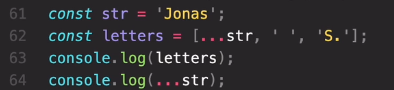

Prints

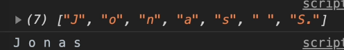

* Make a shallow copy of an array
* Join two or more arrays together

```js
...newArray // this prints 1 2 7 8 9
```

Real world example:

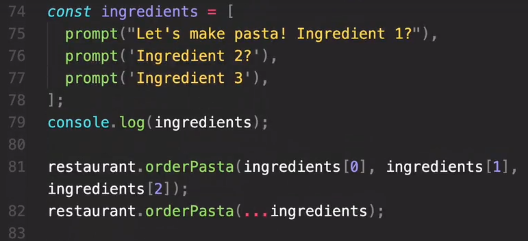

Spread operator for add propertys to other object and make a shallow copy:
  
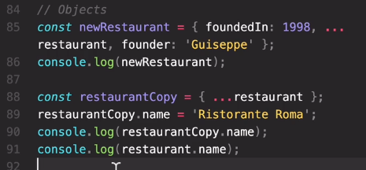

> spread operator is used where we would otherwise write values separated by commas

More info: [js-spread-operator](https://www.javascripttutorial.net/es6/javascript-spread/)

## Rest Pattern

Pack elements.

We use the REST in the LEFT side of =

Collect multiple elements and condence them into an array.

The rest pattern must be the last in the array.

```js
const [a, b, ...others] = [1, 2, 3, 4, 5];
console.log(a, b, others);//This prints 1 2 [3, 4, 5]
```

Also, we can use the rest pattern with objects.

## Rest parameter

We can use the rest parameter to dinamically add values to a parameter function:

```js
const add = function (...numbers) {
  let sum = 0;
  for (let i = 0; i < numbers.length; i++) sum += numbers[i];
  console.log(sum);
};

add(2, 3); //5
add(5, 3, 7, 2); //17
add(8, 2, 5, 3, 2); //20
```

We can use the spread operator to unpack the array in the add arguments:

```js
const x = [23, 5, 7];
add(...x); //using spread operator
```

> rest operator is used where we would write variable names separated by commas

another example of rest:

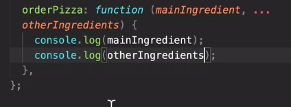

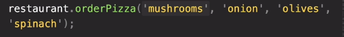

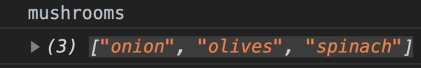

More info: [js-rest-pattern](https://javascript.info/rest-parameters-spread)

More info: [js-rest-parameters](https://www.javascripttutorial.net/es6/javascript-rest-parameters/)

## Short circuiting (|| and &&)

We use the or (||) and the and (&&) for short circuiting

This works with the truthy and falsy values

## Nullish operator

This is used as the || operator, but only works with null and undefined values (NOT 0 or ''):

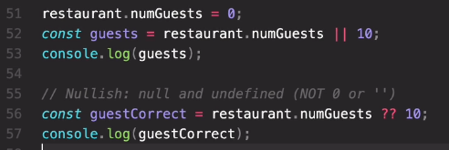

`The image above prints 10 and 0`

## Logical Assigment Operators

This is a brief form or do short circuiting:

```js
//OR assigment
// rest1.numGuests = rest1.numGuests || 10;
rest1.numGuests ||= 10;

//AND assigment
// rest2.owner = rest2.owner && '<ANONYMOUS>';
rest2.owner &&= '<ANONYMOUS>';
```

## The for-of loop

## Enhanced object literals

## Optional chaining

## Looping objects: Object Keys values and entries

## Sets

A set is a unique collection of unique values, it cannot have duplicates values.

The order of the elements is irrelevant

The sets does not have indexes

Sets are iterable

The main use of sets its remove duplicate values from arrays

```js
let ordersSet = new Set([
  'pasta',
  'pizza',
  'pizza',
  'risotto',
  'pasta',
  'pizza',
]);
console.log(ordersSet); //delete the duplicates

console.log(new Set('Jonas'));

console.log(ordersSet.size);

console.log(ordersSet.has('pizza'));
console.log(ordersSet.has('bread'));
ordersSet.add('garlic bread');
ordersSet.delete('risotto');
// ordersSet.clear();
console.log(ordersSet);

for (let order of ordersSet) console.log(order);

//main use
const staff = ['waiter', 'chef', 'waiter', 'manager', 'chef', 'waiter'];
console.log(staff);
const stafUnique = [...new Set(staff)];
console.log(stafUnique);

console.log(
  new Set(['waiter', 'chef', 'waiter', 'manager', 'chef', 'waiter']).size
);

console.log(new Set('antonisoto').size);
```

## Maps

Maps are a data structure that we can use to map values to keys.

Data is stored in key value pairs in maps.

```js

const rest = new Map(); //new Map() creates the a map
rest.set('name', 'Classico Italiano'); //set for add a new element
rest.set(1, 'Firenze Italy');
console.log(rest.set(2, 'Lisbon Portugal')); //this also add a element to the map

//We can concatenate multiples sets
rest
  .set('categories', ['Italian', 'Pizzeria', 'Vegetarian', 'Organic'])
  .set('open', 11)
  .set('closed', 23)
  .set(true, 'We are open :D')
  .set(false, 'We are closed :(');

console.log(rest.get('name')); //Get for obtain the value with the key
console.log(rest.get(true));
console.log(rest.get(1));

//We can use this pattern to get the keys and prints the value
const time = 8;
console.log(rest.get(time > rest.get('open') && time < rest.get('close')));

console.log(rest.has('categories'));
rest.delete(2);
//rest.clear();

//we can use an array as key
const arr = [1, 2];
rest.set(arr, 'Test');
rest.set(document.querySelector('h1'), 'Heading');

console.log(rest);
console.log(rest.size);//We can use size for maps or sets as the same like lenght with arrays
console.log(rest.get(arr));
```

## Maps Iteration

```js
//Convert object to map

const weekdays = ['mon', 'tue', 'wed', 'thu', 'fri', 'sat', 'sun'];
const openingHours = {
  [weekdays[3]]: {
    open: 12,
    close: 22,
  },
  [weekdays[4]]: {
    open: 11,
    close: 23,
  },
  [weekdays[5]]: {
    open: 0, // Open 24 hours
    close: 24,
  },
};
console.log(Object.entries(openingHours));
const hoursMap = new Map(Object.entries(openingHours));
console.log(hoursMap);

//---------
//We can add elements to map passing an array of arrays

const question = new Map([
  ['question', 'what is the best programming language in thw world?'],
  [1, 'C'],
  [2, 'Java'],
  [3, 'Javascript'],
  ['correct', 3],
  [true, 'correct ✨'],
  [false, 'Try again!'],
]);

console.log(question);

//MAP ITERATION
//Quiz app
console.log(question.get('question'));
for (const [key, value] of question) {
  if (typeof key === 'number') {
    console.log(`Answer ${key}: ${value}`);
  }
}
// let answer = Number(prompt('Your answer:'));
let answer = 3;
console.log(answer);

//This is equivalent to the if below
console.log(question.get(answer === question.get('correct')));

if (answer === question.get('correct')) {
  console.log(question.get(true));
} else {
  console.log(question.get(false));
}

//convert map to array

console.log([question]);
// console.log(question.entries());
console.log([question.keys()]);
console.log([question.values()]);

//convert map to array unpacking the values, the correct way instead above

console.log([...question]);
// console.log(question.entries());
console.log([...question.keys()]);
console.log([...question.values()]);

```

## Strings

```js
const airline = 'TAP Air Portugal';
const plane = 'A320';

console.log(plane[0]); //A
console.log(plane[1]); //3
console.log(plane[2]); //2
console.log('B737'[0]); //B

console.log(airline.length); //we can use lenght method with strings
console.log('B737'.length);

console.log(airline.indexOf('r'));
console.log(airline.lastIndexOf('r')); //shows the index of the last string founded
console.log(airline.indexOf('portugal'));

// We can use slice function to get a piece of the string on the started index or at started and end position
//We can also use negative positions
console.log(airline.slice(4)); //Air Portugal
console.log(airline.slice(4, 7)); //Air

console.log(airline.slice(0, airline.indexOf(' '))); //TAP
console.log(airline.slice(airline.lastIndexOf(' ') + 1)); //Portugal

console.log(airline.slice(-2));
console.log(airline.slice(1, -1));

const checkMiddleSeat = function (seat) {
  //B and E are the middle seats
  const s = seat.slice(-1);
  if (s === 'B' || s === 'E') console.log('you got middle seat 😆');
  else console.log('You got lucky 😎');
};

checkMiddleSeat('11B');
checkMiddleSeat('23C');
checkMiddleSeat('3E');

//We can use methods with strings because the string are converted to objects and after use the method return to an string

console.log(new String('jonas'));
console.log(typeof new String('jonas'));

console.log(typeof new String('jonas').slice(1));

```

---

```js

// const airline = 'TAP Air Portugal';
console.log(airline.toLowerCase());
console.log(airline.toUpperCase());

//Fix capitalization in name
const passager = 'jOnAs';
const passagerLower = passager.toLowerCase();
const passagerCorrect = passagerLower[0].toUpperCase() + passagerLower.slice(1);
console.log(passagerCorrect);

//Comparing emails
const email = 'hello@jonas.io';
const loginEmail = ' Hello@Jonas.io \n';

//trim() removes the blank spaces or \n things
const normalizedEmail = loginEmail.toLowerCase().trim();
console.log(normalizedEmail);
console.log(email === normalizedEmail);

//REPLACING

const priceGB = '288,97%';
const priceUS = priceGB.replace('%', '$').replace(',', '.');
console.log(priceUS); //288.97$

const announcement =
  'all passagers come to boarding door 23. Boarding door 23!';
console.log(announcement.replace('door', 'gate')); //this replace only the first match
console.log(announcement.replaceAll('door', 'gate')); //this replace all the match
console.log(announcement.replace(/door/g, 'gate')); //we use regular expressions to match all the occurences

//Booleans

const plane2 = 'Airbus A320neo';
console.log(plane2.includes('A320')); //if includes the word returns true
console.log(plane2.includes('Boeing'));
console.log(plane.startsWith('Airb'));

if (plane.startsWith('Airbus') && plane.endsWith('neo')) {
  console.log('Part of the NEW Arirbus family');
}

//PRACTICAL EXERCISE

const checkBaggae = function (items){
  const baggage = items.toLowerCase();
  if(baggage.includes('knife') || baggage.includes('gun')){
    console.log('You are NOT allowed on board');
  }else{
    console.log("Welcome aboard!");
  }
};

checkBaggae("I hava a laptop, some food and a pocket Knife");
checkBaggae("Socks and camera");
checkBaggae("Got some snacks and a gun for protection");
```

---

```js
'use strict';

//SPLIT

console.log('a+very+nice+string'.split('+')); //["a","very","nice","string"]
console.log('Antonio Soto'.split(' ')); //["Antonio", "Soto"]

const [firstName, lastName] = 'Antonio Soto'.split(' ');

const newName = ['Mr.', firstName, lastName.toUpperCase()].join(' '); //Mr. Antonio SOTO
console.log(newName);

const capitalizeName = function (name) {
  const names = name.split(' '); //add every part of the name in an array

  let namesUpper = [];
  for (const n of names) {
    // newName.push(n[0].toUpperCase() + n.slice(1));
    namesUpper.push(n.replace(n[0], n[0].toUpperCase()));
  }

  console.log(namesUpper.join(' ')); //Jose Antonio Soto Hernandez
  console.log(...namesUpper);
};

capitalizeName('jose antonio pedro paramo');
capitalizeName('agatha cristhie');

//Padding (adding characters before or after the string)
const message = 'Go to gate 23!';
console.log(message.padStart(20, '+').padEnd(30, '+'));
console.log('Jonas'.padStart(20, '+').padEnd(30, '+'));

const maskCreditCard = function (number) {
  const str = number + '';
  const last = str.slice(-4);
  return last.padStart(str.length, '*');
};

console.log(maskCreditCard(4337889287014490));
console.log(maskCreditCard('4337889287014490'));

//Repeat
const message2 = 'bad weather... All Departures Delayed... ';
console.log(message2.repeat(5));

```

---

```js
const flights =
  '_Delayed_Departure;fao93766109;txl2133758440;11:25+_Arrival;bru0943384722;fao93766109;11:45+_Delayed_Arrival;hel7439299980;fao93766109;12:05+_Departure;fao93766109;lis2323639855;12:30';

const getFormatCode = str => str.slice(0, 3).toUpperCase();

for (const flight of flights.split('+')) {
  const [type, from, to, time] = flight.split(';');

  const output = `${type.startsWith('_Delayed') ? '🔴' : ''}${type.replaceAll(
    '_',
    ' '
  )} from ${getFormatCode(from)} to ${getFormatCode(to)} (${time.replace(
    ':',
    'h'
  )})`.padStart(45);
  console.log(output);
}
```

## Default parameters

```js
const bookings = [];
//we can define a default parameter creating the function and assign values to the parameters
const createBooking = function (flightNum, numPassagers = 1, price = 199) {
  /*
    ES5
    numPassagers = numPassagers || 1;
    price = price || 199;
    */
  const booking = {
    flightNum,
    numPassagers,
    price,
  };
  console.log(booking);
  bookings.push(booking);
};

createBooking('LH123');
createBooking('LH123', 2, 800);
createBooking('LH123', 8);
createBooking('LH123', 5);

//for ignore a parameter and use the default we use undefined
createBooking('LH123', undefined, 1000);
console.log(bookings);
```

## How passing arguments works

```js
//VALUE VS REFERENCE

//passing a primitive value in a function is like creating a copy outside the function
//when we are passing an object (the only non-primitive) is like passing the same object

const flight = 'LH234';
const antonio = {
  name: 'Antonio Soto',
  passport: 12345,
};

const checkIn = function (flightNum, passager) {
  flightNum = 'LH999';
  passager.name = 'Mr.' + passager.name;

  if (passager.passport === 12345) {
    alert('Checked in');
  } else {
    alert('Wrong passport!');
  }
};
// checkIn(flight, antonio);
// console.log(flight);
// console.log(antonio);

//Is the same as doing...

// const flightNum = flight;
// const passager = antonio;


//example of passing the same object from above

const newPassport = function (person) {
  person.passport = Math.trunc(Math.random() * 100000000);
};
newPassport(antonio);
checkIn(flight, antonio);

//IMPORTANT : js does not have pass by reference, only by value
```

## First class and higher order functions

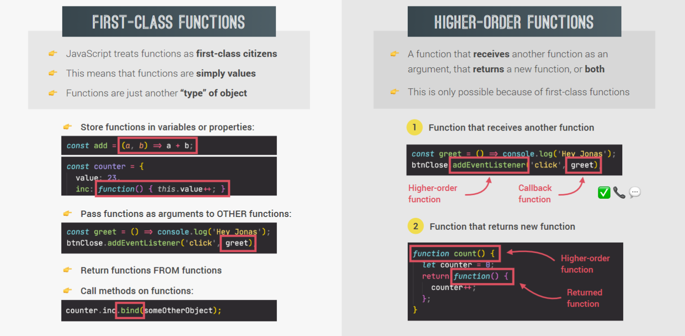

## Functions acepting callback functions

```js
const oneWord = function (str) {
  return str.replace(/ /g, '').toLowerCase();
};

const upperFirstWord = function (str) {
  const [first, ...others] = str.split(' ');
  return [first.toUpperCase(), ...others].join(' ');
};

/*
//higher-order function
because receives another functions

Pros:
-helps to maintain the code clean
-and  allows to create abstraction
 their main goal is to handle complexity by hiding unnecessary details from the user.
*/

const transformer = function (str, fn) {
  console.log(`Original string: ${str}`);
  console.log(`Transformed string: ${fn(str)}`);

  console.log(`Transformed by: ${fn.name}`);
};

transformer('Javascript is the best!', upperFirstWord);
transformer('Javascript is the best!', oneWord);

//JS uses callbacks all the time

const high5 = function () {
  console.log('😁');
};

document.body.addEventListener('click', high5);

```

## Functions returning functions

```js
'use strict';

//This is used in functional programming paradigm

const greet = function (greeting) {
  return function (name) {
    console.log(`${greeting} ${name}`);
  };
};

//Arrow Function version
// const greetArrow = greeting => {
//   return name => {
//     console.log(`${greeting} ${name}`);
//   };
// };
//Shorter version
// const greetArrow = greeting => name => console.log(`${greeting} ${name}`);

const greeterHey = greet('Hey');
greeterHey('Jonas');
greeterHey('Steven');

greet('Hello')('Jonas');
```

## The call and apply method

When we want to use a method outside the object where was created, we use the call method

We use the call method to define manually where the "this" word object refers

The call sintax is call(object, arguments)

```js
const lufthansa = {
  airline: 'Lufthansa',
  iataCode: 'LH',
  bookings: [],
  // book:function(){}
  book(flightNum, name) {
    console.log(
      `${name} booked a seat on ${this.airline} flight ${this.iataCode}${flightNum}`
    );
    this.bookings.push({ flight: `${this.iataCode}${flightNum}`, name });
  },
};

lufthansa.book(239, 'Antonio Soto');
lufthansa.book(635, 'Adriana');

const eurowings = {
  airline: 'Eurowings',
  iataCode: 'EW',
  bookings: [],
};

// Assigning the method book to a variable
// This is possible thanks to first class citizens
const book = lufthansa.book;

// Does not work
book(23, 'Sarah williams');

// call method
book.call(eurowings, 23, 'Sarah Williams');
console.log(eurowings);

book.call(eurowings, 239, 'Mary Cooper');
console.log(lufthansa);

const swiss = {
  airline: 'Swiss Air Lines',
  iatacode: 'LX',
  bookings: [],
};

book.call(swiss, 583, 'Mary Cooper');

//We can use the apply method for passing an array instead of arguments

const flightData = [583, 'George Cooper'];
book.apply(swiss, flightData);
console.log(swiss);
//But is more common do it with modern js spread operator
book.call(swiss, ...flightData);
```

## The bind method

We can use the bind method instead call method

We only call the bind method once instead every time with call method

bind returns a new function(important for event listeners use) instead of call that calls the function

This helps with the lost of "this" word.
[More detailed info about bind:](https://es.javascript.info/bind)

```js
//book.call(eurowings, 23, 'Antonio');

const bookEW = book.bind(eurowings);
const bookLH = book.bind(lufthansa);
const bookLX = book.bind(swiss);

bookEW(23, 'Steven Williams');
//We can specify or "predifine" parts of the arguments before hand with bind method
//This is a common pattern called "partial application"
const bookEW23 = book.bind(eurowings, 23);
bookEW23('Antonio Soto');
bookEW23('Martha Cooper');

//BIND with event listeners
lufthansa.planes = 300;
lufthansa.buyPlane = function () {
  console.log(this);

  this.planes++;
  console.log(this.planes);
};
//lufthansa.buyPlane();

//When we use "this" word in event listeners is assigned to the web element
//for selecting the correct element we use bind
document
  .querySelector('.buy')
  .addEventListener('click', lufthansa.buyPlane.bind(lufthansa));

//Partial application BIND

const addTax = (rate, value) => value + value * rate;
console.log(addTax(0.1, 200));

const addVAT = addTax.bind(null, 0.23);
//this is equivalent to addVAT = value => value + value * 0.23;

console.log(addVAT(100));
console.log(addVAT(23));

```

## Inmediatelly invoked function expressions

IMMEDIATELLY INVOKED FUNCTION EXPRESSIONS (IIFE)

It is a function that is called once and after it disappear

```js
const runOnce = function () {
  console.log('This will never run again (should not be)');
};

runOnce();

//IIFE
(function () {
  console.log('This will never run again');
  const isPrivate = 23;
})();

// console.log(isPrivate); this doesn't print anything due to scope

//IIFE with arrow function
(() => console.log('This will ALSO never run again'))();
```

## Closures

Closures definitions:
  
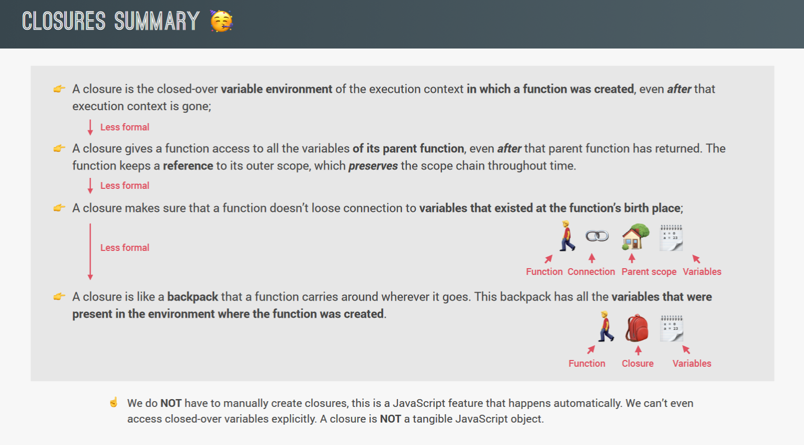

We create a closure when we call a function returning a function

The scope have priority over the scope chain

```js
const secureBooking = function () {
  let passagerCount = 0;

  return function () {
    passagerCount++;
    console.log(`${passagerCount} passagers`);
  };
};

const booker = secureBooking();

booker(); //This prints 1 passagers
booker(); //This prints 2 passagers
booker(); //This prints 3 passagers

console.dir(booker);
```

---

```js
// Example 1
let f;

const g = function () {
  const a = 23;
  f = function () {
    console.log(a * 2);
  };
};

const h = function () {
  const b = 777;
  f = function () {
    console.log(b * 2);
  };
};

g();
f();
console.dir(f);

//Re-assigning f function
h();
f();
console.dir(f);

// Example 2
// The scope have priority over the scope chain
// const perGroup = 1000;
const boardPassagers = function (n, wait) {
  const perGroup = n / 3;

  setTimeout(function () {
    console.log(`We are now boarding all ${n} passagers`);
    console.log(`There are 3 groups, each with ${perGroup} passagers`);
  }, wait * 1000);

  console.log(`Will start boarding in ${wait} seconds`);
};

boardPassagers(180,3);
```

## Array methods

[More detailed info about splice:](https://developer.mozilla.org/en-US/docs/Web/JavaScript/Reference/Global_Objects/Array/splice)

```js
let arr = ['a', 'b', 'c', 'd', 'e'];

// SLICE and SPLICE also works with negative indexes

//SLICE
//Slice method doesn't mutate the original array
//this only takes parts of the array without mutating the original

console.log(arr.slice(2)); // [ "c", "d", "e" ]
console.log(arr.slice(2, 4)); //don't include the final value (4) [ "c", "d" ]
console.log(arr.slice(-2)); //[ "d", "e" ]
console.log(arr.slice(-1)); //[ "e" ]
console.log(`here ${arr.slice(1, -1)}`); //here b,c,d
console.log(arr.slice()); // Shalow copy [ "a", "b", "c", "d", "e" ]
console.log([...arr]); //[ "a", "b", "c", "d", "e" ]

//SPLICE
// SPLICE method mutates the original array (add or delete)
console.log('splice');
arr.splice(2); //the removed part
console.log(arr); //the remaining part [ "a", "b" ]
arr.splice(1, 2);
console.log(arr); //[ "a" ]


// REVERSE
let arr1 = ['a', 'b', 'c', 'd', 'e'];
const arr2 = ['j', 'i', 'h', 'g', 'f'];
console.log(arr2.reverse());
console.log(arr2);

// CONCAT
const letters = arr1.concat(arr2);
console.log(letters);
console.log([...arr1, ...arr2]);

// JOIN
console.log(letters.join(' - '));
```

## The at method

```js
const arr = [23, 11, 64];
console.log(arr[0]);
console.log(arr.at(0));

//getting the last array element
console.log(arr[arr.length - 1]);
console.log(arr.slice(-1)[0]);
console.log(arr.at(-1));

// It also works for arrays
console.log('jonas'.at(0)); // print j
```

## The Foor each loop

```js
'use strict';

const movements = [200, 450, -400, 3000, -650, -130, 70, 1300];

//Using the for of loop
for (const [i, movement] of movements.entries()) {
  if (movement > 0) {
    console.log(`Movement ${i + 1}: You deposited ${movement}`);
  } else {
    console.log(`Movement ${i + 1}: You withdrew ${Math.abs(movement)}`);
  }
}

//FOR EACH LOOP
//We cannot use the break sentence with for each, only with traditional for and for of loop
console.log('---FOREACH---');
movements.forEach(function (mov, i, arr) {
  if (mov > 0) {
    console.log(`Movement ${i + 1}: You deposited ${mov}`);
  } else {
    console.log(`Movement ${i + 1}: You withdrew ${Math.abs(mov)}`);
  }
});

// We can also use for each loop with maps and sets
const currencies = new Map([
  ['USD', 'United States dollar'],
  ['EUR', 'Euro'],
  ['GBP', 'Pound sterling'],
]);

currencies.forEach(function (value, key, map) {
  console.log(`${key}:${value}`);
});

//SET

const currenciesUnique = new Set(['USD', 'GBP', 'USD', 'EUR', 'EUR']);
console.log(currenciesUnique);
//We only use value in sets
currenciesUnique.forEach(function (value, _, map) {
  console.log(`${value}:${value}`);
});
```

## Dom manipulation

We can insert html content to the dom with the method
`insertAdjacentHTML('afterbegin',html)`

Here an example:

```js
const containerMovements = document.querySelector('.movements');
//function to insert the movements in the container 
const displayMovements = function (movements) {
  containerMovements.innerHTML = '';
  //textContent = 0;

  movements.forEach((mov, i) => {
    const type = mov > 0 ? 'deposit' : 'withdrawal';
    const html = `
    <div class="movements__row">
      <div class="movements__type movements__type--${type}">${
      i + 1
    } ${type}</div>
      <div class="movements__value">${mov}</div>
    </div>`;

    containerMovements.insertAdjacentHTML('afterbegin', html);
  });
};

const account1 = {
  owner: 'Jonas Schmedtmann',
  movements: [200, 450, -400, 3000, -650, -130, 70, 1300],
  interestRate: 1.2, // %
  pin: 1111,
};

displayMovements(account1.movements);
```

## Data transformations: map, filter and reduce

MAP METHOD

Map method creates a new array

```js
const eurToUsd = 1.1;
//map create a new array
const movementsUSD = movements.map(mov => {
  return mov * eurToUsd;
});
console.log(movements);
console.log(movementsUSD);

// We could do this instead of the above example:
const movementsUSDfor = [];
for (const mov of movements) movementsUSDfor.push(mov * eurToUsd);
console.log(movementsUSDfor);

//Another example of MAP
const movementsDescriptions = movements.map((mov, i) => {
  `Movement ${i + 1}: You ${mov > 0 ? 'deposited' : 'withdrew'} ${Math.abs(
    mov
  )}`;
});
```

Another example with map:

```js
const account1 = {
  owner: 'Jonas Schmedtmann',
  movements: [200, 450, -400, 3000, -650, -130, 70, 1300],
  interestRate: 1.2, // %
  pin: 1111,
};

const account2 = {
  owner: 'Jessica Davis',
  movements: [5000, 3400, -150, -790, -3210, -1000, 8500, -30],
  interestRate: 1.5,
  pin: 2222,
};

const account3 = {
  owner: 'Steven Thomas Williams',
  movements: [200, -200, 340, -300, -20, 50, 400, -460],
  interestRate: 0.7,
  pin: 3333,
};

const account4 = {
  owner: 'Sarah Smith',
  movements: [430, 1000, 700, 50, 90],
  interestRate: 1,
  pin: 4444,
};

const accounts = [account1, account2, account3, account4];
//MAP example
//function to create an abreviation of the names from account's array
//This function returns the first letter of each name example, js, stw,ss
const createUsernames = function (accs) {
  accs.forEach(function (acc) {
    acc.username = acc.owner
      .toLowerCase()
      .split(' ')
      .map(name => name[0])
      .join('');
  });
};
createUsernames(accounts);
console.log(accounts);
```

## Filter

```js
const movements = [200, 450, -400, 3000, -650, -130, 70, 1300];

//Filter example
//map create a new array
const deposits = movements.filter(mov => {
  return mov > 0;
});

console.log(movements);
console.log(deposits);

// We could do this instead of the above example:
const depositsFor = [];
for (const mov of movements) if(mov > 0) depositsFor.push(mov);
console.log(depositsFor);

const withdrawals = movements.filter(mov => {
    return mov < 0;
});

console.log(withdrawals);
```

## Reduce method

Reduce return a single value from all the array
accumulator -> snowball

REDUCE example:

```js
const movements = [200, 450, -400, 3000, -650, -130, 70, 1300];

// const balance = movements.reduce(function (acc, cur, i, arr) {
//   console.log(`Iteration ${i}: ${acc}`);
//   return acc + cur; //this equals to acc+=cur
// }, 0);

//With arrow function
const balance = movements.reduce((acc, cur) => acc + cur, 0);

// We could do this instead of the above example:
let balance2 = 0;
for (const mov of movements) balance2 += mov;
console.log(balance2); //3840

const max = movements.reduce((acc, mov, i) => {
  console.log(acc);
  if (acc > mov) {
    return acc;
  } else {
    return mov;
  }
}, movements[0]);

console.log(max); //3000
```

## Chaining methods

CHAINING METHODS
We can chain some of the methods in js, we need that the first method returns an array

```js
const movements = [200, 450, -400, 3000, -650, -130, 70, 1300];

const eurToUsd = 1.1;

//PIPELINE
const totalDepositsUSD = movements
  .filter(mov => mov > 0)
  .map((mov, i, arr) => {
    return mov * eurToUsd;
  })
  .reduce((acc, mov) => acc + mov, 0);
console.log(totalDepositsUSD);
```

## Find and findIndex method

Find method only returns the first element that accepts the condition
alike filter method that returns a new array:

```js
const account1 = {
  owner: 'Jonas Schmedtmann',
  movements: [200, 450, -400, 3000, -650, -130, 70, 1300],
  interestRate: 1.2, // %
  pin: 1111,
};

const account2 = {
  owner: 'Jessica Davis',
  movements: [5000, 3400, -150, -790, -3210, -1000, 8500, -30],
  interestRate: 1.5,
  pin: 2222,
};

const account3 = {
  owner: 'Steven Thomas Williams',
  movements: [200, -200, 340, -300, -20, 50, 400, -460],
  interestRate: 0.7,
  pin: 3333,
};

const account4 = {
  owner: 'Sarah Smith',
  movements: [430, 1000, 700, 50, 90],
  interestRate: 1,
  pin: 4444,
};

const accounts = [account1, account2, account3, account4];

const movements = [200, 450, -400, 3000, -650, -130, 70, 1300];

const firstWithdrawal = movements.find(mov => mov < 0);

console.log(movements);
console.log(firstWithdrawal);

console.log(accounts);

const account = accounts.find(acc => acc.owner === 'Jessica Davis');
console.log(account);

```

Find index
Find index works similary to find but instead of return the value returns the index of the value

```js

const index = accounts.findIndex(
  acc => acc.username === currentAccount.username
);

console.log(index);
```

## Some and every method

We use the some method to test a condition in the array,
returns true if at least one value pass the condition

```js
const movements = [200, 450, -400, 3000, -650, -130, 70, 1300];


console.log(movements);

//Equality
console.log(movements.includes(-130)); //true

//condition (SOME METHOD)
console.log(movements.some(mov => mov === -130)); //true

const anyDeposits = movements.some(mov => mov > 0);
console.log(anyDeposits); //true

//-EVERY METHOD
// Every works similary to some but
// all the values in the array must pass the condition to return true

console.log(movements.every(mov => mov > 0)); //false

//We can write the callback outside the paramethers of the funcion
//This helps with the DRY principle
const deposit = mov => mov > 0;
console.log(movements.every(deposit));
console.log(movements.some(deposit));
console.log(movements.filter(deposit));
```

## Flat and flatmap methods

```js
const account1 = {
  owner: 'Jonas Schmedtmann',
  movements: [200, 450, -400, 3000, -650, -130, 70, 1300],
  interestRate: 1.2, // %
  pin: 1111,
};

const account2 = {
  owner: 'Jessica Davis',
  movements: [5000, 3400, -150, -790, -3210, -1000, 8500, -30],
  interestRate: 1.5,
  pin: 2222,
};

const account3 = {
  owner: 'Steven Thomas Williams',
  movements: [200, -200, 340, -300, -20, 50, 400, -460],
  interestRate: 0.7,
  pin: 3333,
};

const account4 = {
  owner: 'Sarah Smith',
  movements: [430, 1000, 700, 50, 90],
  interestRate: 1,
  pin: 4444,
};

const accounts = [account1, account2, account3, account4];


//We use the FLAT method to get all the elements of sub-array in a single array
const arr = [[1, 2, 3], [4, 5, 6], 7, 8];
console.log(arr.flat()); // [1,2,3,4,5,6,7,8]

//We can also specify levels of deep in the arguments of flat
const arrDeep = [[[1, 2], 3], [4, [5, 6]], 7, 8];
console.log(arrDeep.flat(2)); // [1,2,3,4,5,6,7,8]

// FLAT
const overalBalance = accounts
  .map(acc => acc.movements)
  .flat()
  .reduce((acc, mov) => acc + mov, 0);
console.log(overalBalance); //17840

//Flat map (is like use map and then flat methods together)
//Decreases the proccesing, it's more optimal
const overalBalance2 = accounts
  .flatMap(acc => acc.movements)
  .reduce((acc, mov) => acc + mov, 0);
console.log(overalBalance2);
```

## More ways of creating and filling arrays

```js
//Clasical ways of create an array
const arr = [1, 2, 3, 4, 5, 6, 7];
console.log(new Array(1, 2, 3, 4, 5, 6, 7));

//Create empty arrays "programmatically"
const x = new Array(7);
console.log(x); //Array(7) [ <7 empty slots> ]

//Fill method for above example
x.fill(1, 3, 5); //begining and end index (3,5)
console.log(x); //Array(7) [ <3 empty slots>, 1, 1, <2 empty slots> ]
x.fill(1);
console.log(x); //Array(7) [ 1, 1, 1, 1, 1, 1, 1 ]

arr.fill(23, 2, 6);
console.log(arr); //Array(7) [ 1, 2, 23, 23, 23, 23, 7 ]

//Array.from method (defines a new array or also can convert something to array)

const y = Array.from({ length: 7 }, () => 2);
console.log(y); //Array(7) [ 2, 2, 2, 2, 2, 2, 2 ]

const z = Array.from({ length: 7 }, (_, i) => i + 1);
console.log(z); //Array(7) [ 1, 2, 3, 4, 5, 6, 7 ]

//Array.from example to convert nodeList to array

labelBalance.addEventListener('click', function () {
  const movementsUI = Array.from(
    document.querySelectorAll('.movements__value'),
    el => Number(el.textContent.replace('', ''))
  );
  console.log(movementsUI); //Array(8) [ 1300, 70, -130, -650, 3000, -400, 450, 200 ]

  //Another way of convert the nodeList to array with spread operator
  const movementsUI2 = [...document.querySelectorAll('.movements__value')];

});
```

Array.from method allows chaining methods, spread operator does not

## Numbers

```js

// All the numbers in js are represented in floating point
// 23 === 23.0 true

//Conversion
//Classic method
console.log(Number('23'));
console.log(+'23');

//Parsing (get only the number)
//second paramter to define the base number
console.log(Number.parseInt('30px', 10)); //30
console.log(Number.parseInt('e23', 10)); //NaN

console.log(Number.parseInt(' 2.5rem')); //2
console.log(Number.parseFloat(' 2.5rem')); //2.5

//Check if a value is NaN
console.log(Number.isNaN(20)); //false
console.log(Number.isNaN('20')); //false
console.log(Number.isNaN(+'20X')); //true
console.log(Number.isNaN(23 / 0)); //false

// Checking if a value is a number
console.log(Number.isFinite(20)); //true
console.log(Number.isFinite('20')); //false
console.log(Number.isFinite(+'20X')); //false
console.log(Number.isFinite(23 / 0)); //false

//For integers
console.log(Number.isInteger(23)); //true
console.log(Number.isInteger(23.0)); //true
console.log(Number.isInteger(23 / 0)); //false
```

## Math methods and rounding

```js
//sqrt root
console.log(Math.sqrt(25)); //5
console.log(25 ** (1 / 2)); //5
console.log(8 ** (1 / 3)); //2

//max and min method
console.log(Math.max(5, 18, 23, 11, 2)); //23
//max makes type coercion but not parsing
console.log(Math.max(5, 18, '25', 11, 2)); //25
console.log(Math.max(5, 18, '23px', 11, 2)); // not work NaN

console.log(Math.min(5, 18, 26, 11, 2)); //random

console.log(Math.PI * Number.parseFloat('10px') ** 2);

//Classic random numbers

console.log(Math.trunc(Math.random() * 6) + 1);

//General function for random numbers

const randomInt = (min, max) =>
  Math.floor(Math.random() * (max - min) + 1) + min;
//0...1 -> 0...(max - min) -> min...max
//console.log(randomInt(10, 20));

//Rounding integers
//round to the closest decimal 5> or 5<
console.log(Math.round(23.3)); //23
console.log(Math.round(23.9)); //24

// round to the highest decimal
console.log(Math.ceil(23.3)); //24
console.log(Math.ceil(23.9)); //24

// round to the lowest decimal
console.log(Math.floor(23.3)); //23
console.log(Math.floor('23.9')); //23 floor makes type coercion

//trunc eliminates the decimals
console.log(Math.trunc(23.3)); //23

//floor is more accurate for rounding
console.log(Math.trunc(-23.3)); //-23
console.log(Math.floor(-23.3)); //-24

//rounding decimals
//To fixed returns a string
console.log((2.7).toFixed(0)); // 3 string
console.log((2.7).toFixed(3)); //2.700 string
console.log((2.345).toFixed(2)); //2.35 string
//convert to number with "+"
console.log(+(2.345).toFixed(2)); //2.35 number
```

## Numeric separator

```js
//We can use "_" to simulate "," in numbers
//Numbers with _ are printed normal

const diameter = 287_460_000_000;
console.log(diameter); //287460000000

const price = 345_99;
console.log(price); //345_99

const transferFee1 = 15_00;
const transferFee2 = 1_500;

const PI = 3.1415;
console.log(PI);

//this will not work, only work for numbers
console.log(Number('230_000'));
```

## BigInt

```js
//We can use bigInt for huge numbers

console.log(2 ** 53 - 1);
console.log(Number.MAX_SAFE_INTEGER);

//the next numbers not work correctly sometimes, not use it
console.log(2 ** 53 + 1);
console.log(2 ** 53 + 2);
console.log(2 ** 53 + 3);
console.log(2 ** 53 + 4);

//For use big int add a "n" letter at the end of the number

console.log(483930292830283902810182902839028302n);
console.log(BigInt(48492832));

//Operations
//it work with *
console.log(10000n + 10000n);
console.log(3648273892738272823729102829362916n * 100000n);

//It does not work with Math methods

const huge = 20293029372902830281071n;
const num = 23;
console.log(huge * BigInt(num));

//Exceptions
console.log(20n > 15);
console.log(20n === 20);
console.log(typeof 20n);
console.log(20n == '20');

//string concatenations work
console.log(huge + 'is REALLY big!!!');

//Divisions
//Divisions with BigInt don't show the decimals parts
console.log(11n / 3n);
console.log(10 / 3);
```

## Dates

```js
const account1 = {
  owner: 'Jonas Schmedtmann',
  movements: [200, 455.23, -306.5, 25000, -642.21, -133.9, 79.97, 1300],
  interestRate: 1.2, // %
  pin: 1111,

  movementsDates: ['2019-11-18T21:31:17.178Z'],
};

//Creating a date (actual date)
const now = new Date();
console.log(now);

//We can define a specific date (not recommended)

console.log(new Date('Aug 02 2020 18:05:41'));
console.log(new Date('December 24,2015')); //Thu Dec 24 2015 00:00:00 GMT-0600
//getting a date and print it
console.log(new Date(account1.movementsDates[0])); //Mon Nov 18 2019 15:31:17 GMT-0600 (hora estándar central)

//We can define year, month, day, hour, minutes and seconds i Dates' constructor

console.log(new Date(2037, 10, 19, 15, 23, 5)); //Thu Nov 19 2037 15:23:05 GMT-0600
console.log(new Date(2037, 10, 31)); //Tue Dec 01 2037 00:00:00 GMT-0600

console.log(new Date(0)); //Wed Dec 31 1969 18:00:00 GMT-0600

//Transform hours to milliseconds (as a result we get a timestamp and this is the date printed)
console.log(new Date(3 * 24 * 60 * 60 * 1000)); // Sat Jan 03 1970 18:00:00 GMT-0600

//working with dates
const future = new Date(2037, 10, 19, 15, 23);
console.log(future);
console.log(future.getFullYear());
console.log(future.getMonth());
console.log(future.getDate());
console.log(future.getDay());
console.log(future.getHours());
console.log(future.getMinutes());
console.log(now.getSeconds());
console.log(future.toISOString()); //2037-11-19T21:23:00.000Z
console.log(future.getTime()); // get the timestamp 2142278580000

console.log(new Date(21422569980000)); // Wed Nov 08 2648 03:53:00 GMT-0600
console.log(Date.now()); //2142278580000
future.setFullYear(20); //i dont understand why the result always changes
console.log(future);

//calc how many days passed

const future1 = new Date(2037, 10, 19, 15, 23);
console.log(+future); //converting to number

const calcDaysPassed = (date1, date2) =>
  Math.round(Math.abs(date2 - date1) / (1000 * 60 * 60 * 24));

const days1 = calcDaysPassed(new Date(2037, 3, 4), new Date(2037, 3, 14));
console.log(days1);
```

## Internationalizing dates

```js
'use strict';

//straightforward way of doing
const now = new Date();
console.log(now);

const locale = navigator.language;
console.log(locale);
//We can search the code in http://www.lingoes.net/en/translator/langcode.htm

let formatDate = new Intl.DateTimeFormat(locale).format(now);
console.log(formatDate); //26/4/2023

//second method with options

const options = {
  hour: 'numeric',
  minute: 'numeric',
  day: 'numeric',
  month: 'long',
  year: 'numeric',
  weekday: 'long',
};

formatDate = new Intl.DateTimeFormat(locale, options).format(now);
console.log(formatDate); //miércoles, 26 de abril de 2023, 10:11
```

## Internationalizing numbers

```js
const num = 3884764.23;

const options = {
  style: 'currency',
  unit: 'celsius',
  currency: 'EUR',
};

//using the paramether of options
console.log('US: ', new Intl.NumberFormat('en-US', options).format(num)); //US: €3,884,764.23

console.log(
  'Germany:    ',
  new Intl.NumberFormat('de-DE', options).format(num)
); //Germany: 3.884.764,23 €

console.log('Mexico:    ', new Intl.NumberFormat('es-MX', options).format(num)); //Mexico: EUR 3,884,764.23

console.log(
  'Navigator auto:    ',
  new Intl.NumberFormat(navigator.language, options).format(num)
);

//we can create a general function
//function to format numbers with Intl
const formatCur = function (value, locale, currency) {
  return new Intl.NumberFormat(locale, {
    style: 'currency',
    currency: currency,
  }).format(value);
};
```

## setTimeout

```js
'use strict';

//The "setTimeout" timer runs just once after a defined time
//Also we have the "setInterval" timer that keeps running forever until we stop it

//setTimeout with parameters

const ingredients = ['olives', 'spinach'];
const pizzaTimer = setTimeout(
  (ing1, ing2) => console.log(`Here is your pizza with ${ing1} and ${ing2} 🍕`),
  3000,
  ...ingredients
);

console.log('Waiting');

if (ingredients.includes('spinach')) {
  clearTimeout(pizzaTimer);
  //setTimeout without parameters (classic)
  setTimeout(() => console.log('There is not pizza for you'), 3000);
}

//setInterval

setInterval(function () {
  const now = new Date();
  console.log(now);
}, 1000);

//Creating a clock
setInterval(function () {
    const now = new Date();
    let hours = `${now.getHours()}`.padStart(2, '0');
    let minutes = `${now.getMinutes()}`.padStart(2, '0');
    let seconds = `${now.getSeconds()}`.padStart(2, '0');
    console.log(`${hours}:${minutes}:${seconds}`);
  }, 1000);
```

## Select, create and delete elements

```js
'use strict';

//select all the html page
console.log(document.documentElement);
//select the head
console.log(document.head);
//select the body
console.log(document.body);

//select the first element with the header class
const header = document.querySelector('.header');

//select all the elements with the section class
//returns a node list
const allSections = document.querySelectorAll('.section');
console.log(allSections);

//selecting element by #
console.log(document.getElementById('section--1'));

//This returns a htmlCollections (which is updated automatically
//if we delete an element unlike node that doesn't update automatically)
const allButtons = document.getElementsByTagName('button');
console.log(allButtons);

//this also returns a htmlCollection
console.log(document.getElementsByClassName('btn'));

//------Creating and inserting elements------
//.insertAdjacentElement
const message = document.createElement('div');
message.classList.add('cookie-message');

//insert text content
// message.textContent = 'we use cookies for improved functionality and analytics';

//insert text with html tags
message.innerHTML =
  'We use cookies for improved functionality and analytics. <button class="btn btn--close-cookie">Got it!</button>';

//insert content before or after(but inside of the tag)
// header.prepend(message)
header.append(message);

//also this append or prepend only allow to insert the element only ance at least it will be copy with cloneNode
header.append(message.cloneNode(true));

//insert content before or after a tag (but ouside of it)
//header.before(message);
//header.after(message);

//------Delete element-----
document
  .querySelector('.btn--close-cookie')
  .addEventListener('click', function () {
    message.remove();
    //old way with dom traversing
    // message.parentElement.removeChild(message);
  });

``` 

## Styles, attributes and classes 

```js
//styles (change properties)
message.style.backgroundColor = '#37383d';
message.style.width = '103%';

//we can only print properties in which we define manually the style as the two above
console.log(message.style.color); //this prints <empty sting>
console.log(message.style.backgroundColor); //rgb(55, 56, 61)

//if we want to print or get a specific style define in the css file
//we use getComputedStyle function

console.log(getComputedStyle(message).color); //rgb(187, 187, 187)
console.log(getComputedStyle(message).height); //49.5333px

//getting and changing height property
message.style.height =
  Number.parseFloat(getComputedStyle(message).height, 10) + 30 + 'px';

//for change a css variable, we use style.setProperty
document.documentElement.style.setProperty('--color-primary', 'orangered');

//ATTRIBUTES
//get attributes from html tag
const logo = document.querySelector('.nav__logo');
console.log(logo.alt); //Bankist logo
console.log(logo.src); //http://127.0.0.1:5500/img/logo.png
console.log(logo.className); //nav__logo

//set attribute
logo.alt = 'Beautiful minimalism logo';

//non-standrd
//we add the property designer manually
console.log(logo.designer); //does not work "undefined"
//we can access with getAttribute()
console.log(logo.getAttribute('designer')); //antonio
//adding a new attribute
logo.setAttribute('company', 'Bankist');

//how to get the absolute and relative link
console.log(logo.src); //http://127.0.0.1:5500/img/logo.png
console.log(logo.getAttribute('src')); //img/logo.png

const link = document.querySelector('.nav__link--btn');
console.log(link.href); //http://127.0.0.1:5500/index.html#
console.log(link.getAttribute('href')); //#

//get Data attributes
console.log(logo.dataset.versionNumber);

//CLASSES
logo.classList.add('c', 'j');
logo.classList.remove('c', 'j');
logo.classList.toggle('c', 'j');
logo.classList.contains('c', 'j'); //not includes

//don't use  (it overwrite all the classes)
logo.className = 'jonas';
```

## Implementing smooth scrolling (all or specific sections)

Image explanation:

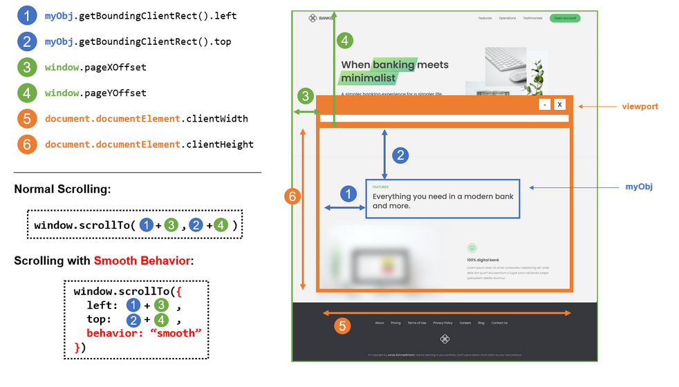

```js
'use strict';

const btnScrollTo = document.querySelector('.btn--scroll-to');
const section1 = document.querySelector('#section--1');

btnScrollTo.addEventListener('click', function (e) {
  const s1coords = section1.getBoundingClientRect();
  console.log(s1coords);

  console.log(e.target.getBoundingClientRect());

  console.log('Current scroll (x/y)', window.pageXOffset, window.pageYOffset);

  console.log(
    'height/widht viewport',
    document.documentElement.clientHeight,
    document.documentElement.clientWidth
  );
  //Old way of doing it
  //Scrolling
  //Not passing an object

  //   window.scrollTo(
  //     s1coords.left + window.pageXOffset,
  //     s1coords.top + window.pageYOffset
  //   );

  //passing an object
  // window.scrollTo({
  //   left: s1coords.left + window.pageXOffset,
  //   top: s1coords.top + window.pageYOffset,
  //   behavior: 'smooth',
  // });

  //modern way
  section1.scrollIntoView({ behavior: 'smooth' });

  //the easiest way of doing without js
  //In css file
  //   html,body{
  //     scroll-behavior: smooth;
  //   }
});
```

## Types of events and event handlers

```js
'use strict';

const h1 = document.querySelector('h1');

//This is another way of add event listeners
const alertH1 = function (e) {
  alert('AddEventListener: Great! You are reading the heading :D');
  //for delete after using only once
  //   h1.removeEventListener('mouseenter', alertH1);
};
//this way allows us to delete the event listener as we can see in the set timeout
//with the removeEventListener
h1.addEventListener('mouseenter', alertH1);

setTimeout(() => h1.removeEventListener('mouseenter', alertH1), 3000);
```
